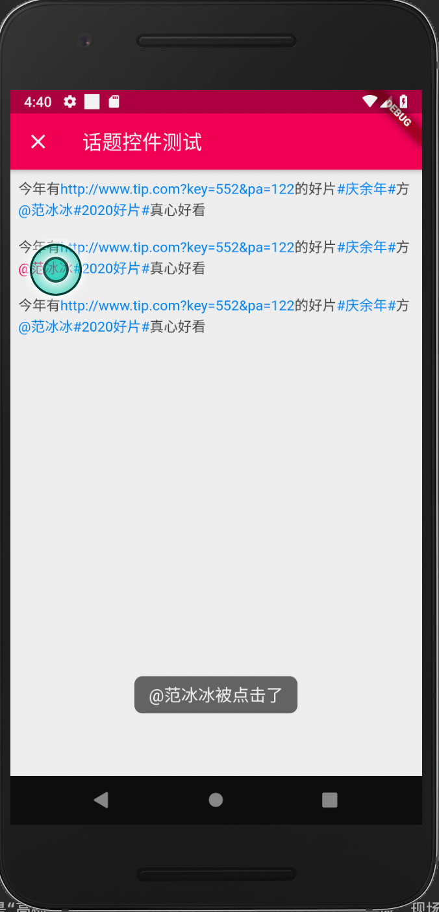

# topic_text

topic text like webo ## wrap text ,which can click，自动识别 微博话题/微博@人，链接，可以定制点击

## Getting Started



```dart
import 'package:topic_text/topic_text.dart';
import 'package:flutter/material.dart';
import 'package:bot_toast/bot_toast.dart';

class TopicTest extends StatefulWidget {
  @override
  _TopicTestState createState() => _TopicTestState();
}

class _TopicTestState extends State<TopicTest> {
  @override
  Widget build(BuildContext context) {
    return Scaffold(
      appBar: AppBar(
        title: Text('话题控件测试'),
      ),
      body: ListView(
        children: <Widget>[
          Padding(
            padding: const EdgeInsets.all(8.0),
            child: Center(
                child: TopicText(
              '今年有http://www.tip.com?key=552&pa=122的好片#庆余年#方@范冰冰#2020好片#真心好看',
              onUrlTap: (str) {
                BotToast.showText(text: '$str被点击了');
              },
            )),
          ),
          Padding(
            padding: const EdgeInsets.all(8.0),
            child: Center(
                child: TopicText(
              '今年有http://www.tip.com?key=552&pa=122的好片#庆余年#方@范冰冰#2020好片#真心好看',
              atColor: Colors.pink,
              onAtTap: (str) {
                BotToast.showText(text: '$str被点击了');
              },
            )),
          ),
          Padding(
            padding: const EdgeInsets.all(8.0),
            child: Center(
              child: TopicText(
                '今年有http://www.tip.com?key=552&pa=122的好片#庆余年#方@范冰冰#2020好片#真心好看',
                onTopicTap: (str) {
                  BotToast.showText(text: '$str被点击了');
                },
              ),
            ),
          ),
        ],
      ),
    );
  }
}

```